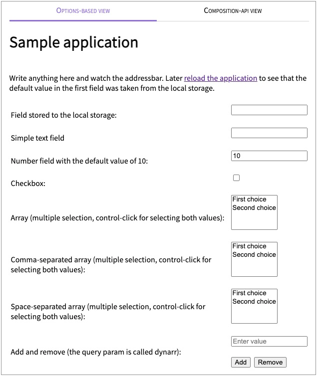

# @oarepo/vue-query-synchronizer

In browser applications, address bar should be the most important source
of truth. When user performs data filtering, sorting, pagination, the url should
change so that the result of the filtering is bookmarkable/shareable.

Traditionally vue component would listen on query change and copy the
query params to an internal model. This would be then used by an input
component. Whenever the input is changed, an event listener (after optional
debouncing) would propagate the change back to the query.

This library does all of this on the background, leaving you with just
a couple of lines of code.

<!-- toc -->

- [Installation](#installation)
  * [From sources](#from-sources)
- [Usage](#usage)
  * [Plugin installation](#plugin-installation)
  * [Router configuration](#router-configuration)
  * [Component](#component)
- [Demo setup and run](#demo-setup-and-run)
  * [Screenshot](#screenshot)
- [Library build](#library-build)
- [API](#api)
  * [``QuerySynchronizer`` plugin configuration](#querysynchronizer-plugin-configuration)
  * [``query``](#query)
    + [definition](#definition)
  * [``Datatype``](#datatype)
  * [Callbacks and signals](#callbacks-and-signals)
    + [``onInit``](#oninit)
    + [``onLoad``](#onload)
    + [``onChange``](#onchange)

<!-- tocstop -->

## Installation
```
yarn add @oarepo/vue-query-synchronizer
```

### From sources
```
yarn build
cd dist; yarn link

cd your_project
yarn link @oarepo/vue-query-synchronizer
```

## Usage

### Plugin installation

Add the following to ``main.js`` (in quasar ``boot/....js``)

```javascript
import QuerySynchronizer from '@oarepo/vue-query-synchronizer'

Vue.use(QuerySynchronizer, {
    router: router
})
```
See [src/main.js](src/main.js) for the whole file.

### Router configuration

In router configuration, mark which query parameters with a given type and default value
should be synchronized with the component state:

```javascript
import { query } from '@oarepo/vue-query-synchronizer'

const routes = [
{
    path: '/',
    name: 'home',
    meta: {
        query: {
           'page': 'int:1'
        }
    },
    component: Home
}
]
```
Full example at [src/router.js](src/router.js)

### Component

In component, use ``this.$query`` to access parsed query. Then
you can use properties at ``$query``, for example 
``$query.filter``, ``$query.sort`` as normal models for
html inputs or as models for any other components:

```vue
<template>
<div>
    <input v-model="$query.filter"><br><br>
    <pre>{{$rawQuery}}</pre>
</div>
</template>

<script>
export default {
    name: 'home',
}
</script>
```
Full example at [src/Home.vue](src/Home.vue)

The ``$rawQuery`` gives access to the raw data, ``$query`` 
is 

## Demo setup and run
```
yarn install
yarn run serve
```

### Screenshot



## Library build
```
yarn run build
```

## API

### ``QuerySynchronizer`` plugin configuration

During plugin registration, ``router`` must be passed in. Optionally
a global ``debounce`` can be set, the default if unset is 100ms. 
 

```javascript
import QuerySynchronizer from '@oarepo/vue-query-synchronizer'

Vue.use(QuerySynchronizer, {
    router: router,
    datatypes: {
        name: handler
    },
    debug: false
})
```

Setting ``debug`` to ``true`` will log the parsed and serialized query parameters.

### ``query``

The potential query parameters with data types are stored in route,
``meta.query`` property in the form of ``param_name``:``definition``.

#### definition

Definition can be:

   * default string value (``test``)
   
   * datatype followed by a default value
     (``int:1``)
     
   * an object:

```javascript
{
    datatype: 'string',
    defaultValue: null
}
``` 

The object can define a datatype, which is implicitly string. The datatype
defines how the value from URL is converted to model and vice versa. Datatypes
are pluggable, see ``Datatype`` section later in the readme for details. 

If ``defaultValue`` is set and a value is not present in the URL, the model
is set to this value. URL is not changed. When a default value is 
programmatically set on the parameter (for example, user enters it in input),
the parameter is removed from the url.  

**Note:** This means that if you change the default value of a parameter
during the lifetime of your application, user's bookmarks will start
behaving differently as your code will receive the new default values,
not the ones used when user bookmarked the page.

### ``Datatype``

A datatype provides means to convert url parameter into an internal model
value and vice versa. The pre-installed datatypes are:
   * string - a no-op converter
   * number - converts string value of the number in url into a javascript number
   * bool - if the parameter is present (with whatever value), returns true else false
   * array - returns an array of string (for parameters with multiple values)
   
A custom datatype can be implemented as follows:

```javascript

Vue.use(QuerySynchronizer, {
    router: router,
    datatypes: {
        lowecase: {
            parseDefault(value) {
                // parses the default value from the strings above
                return (value || '').toLowerCase()
            },
            parse(value, defaultValue) {
                // value is: undefined if property is not present in the url
                // null if property is in url but without a value
                // string value if property is written as url?key=value
 
                // note: defaultValue has been parsed previously so that
                // it already is in the javascript format
                return value ? value.toLowerCase() : defaultValue 
            },
            serialize (value, defaultValue) {
                // this method must return undefined, null or string instance
                // returning undefined will remove the property from query
                if (value === defaultValue) { return undefined }
                // returning null will put url?key without a value to the url
                if (value === '') { return null }
                // will put url?key=value into the url
                return value.toLowerCase()
            }
        }
    }
})

```

Default datatypes are implemented by importable ``StringDatatype``, 
``IntDatatype``, ``BoolDatatype``, ``ArrayDatatype``.

You can use them to create composite datatypes, for example an array
of numbers.

```javascript
ArrayOfNumbersDatatype = {
    parseDefault(value) {
        return ArrayDatatype.parseDefault(value).map(
            x => IntDatatype.parse(x, null)
        )
    },
    parse(value, defaultValue) {
        return ArrayDatatype.parse(value, defaultValue).
            map(x=>IntDatatype.parse(x, null))
    },
    serialize (value, defaultValue) {
        return ArrayDatatype.serialize(
            value.map(x => NumberDataType.serialize(value, null)),
            defaultValue)
    }
}
```

### Callbacks and signals

The following signals can be specified at the query level:

```javascript
import { query } from '@oarepo/vue-query-synchronizer'

const routes = [
{
    path: '/',
    name: 'home',
    meta: {
        query: {...},
        querySettings: {
            onInit (paramsList) { paramsList },
            onLoad (query) { /* do something with query */ },
            onChange (newQuery, query) { /* do something with newQuery */ }
        }
    },
    component: Home
}
]
```

#### ``onInit``

onInit is called when the query is loaded. This signal can be used for example to set default values
stored in local storage or on the server.

#### ``onLoad``

called after browser query parameters are parsed and before they are returned to the component.

#### ``onChange``

called after just before the url is changed. Can be used to store the values to local storage
so that the next onInit picks them and uses them as default. The callback takes two parameters:
  * ``newQuery`` is the new query that will be set to URL. Does not contain props with default values
  * ``query`` contains the whole current query object with resolved default values
